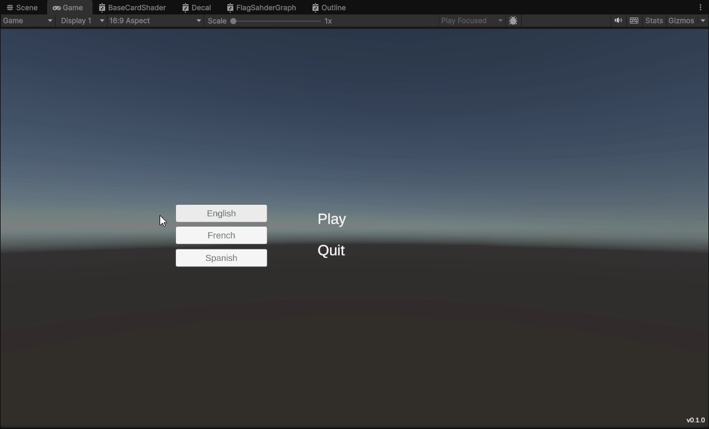

# UnityLiteL10n
A minimal **JSON-Based** localization tool for Unity – Designed for small projects. **[v0.2.0]** This tool currently supports static text only. Variables, plurals, and advanced formatting are not implemented yet.

> This project is made/test under Unity 6.3 (6000.3.1f1)


## Features:

- Simple JSON-based localization
- Runtime language switching
- Automatic fallback to a default language
- TextMeshPro support via `LocalizedText` component

---

<p align="center">
  
</p>

---

## Setup

1. Copy the `UnityLiteL10n` folder into your project under:

```
Assets/Plugins/
```

2. Ensure your localization files are placed in:

```
Resources/Localization/
```

3. Add a `LocalizationManager` component to a GameObject in your scene.

4. Set:
- `DefaultLanguage` (e.g. `EN`)
- `CurrentLanguage` (e.g. `EN`)

5. **Optional**: Configure logging and strict mode
- `LogLevel` (None, ErrorsOnly, Warnings, Verbose)
- `strictMode` (enable to throw errors on invalid JSON / missing languages)
- `missingKeyFormat` (default: "[{0}]") for how missing keys are displayed

---

## JSON Format

Each language file is a simple JSON file:

```
{
  "entries": [
    { "key": "menu.play", "value": "Play" },
    { "key": "menu.quit", "value": "Quit" }
  ]
}
```

> - The filename (e.g. EN.json, FR.json) is used as the language code.  
> - JSON entries must now be valid and non-null; empty files will trigger warnings or errors in strictMode

---

## Usage

### Localized Text

1. Add a TextMeshProUGUI to your UI.
2. Add the `LocalizedText` component.
3. Set the localization key (e.g. `menu.play`).

> The text will automatically update when the language changes.

---

### Change Language at Runtime

```
LocalizationManager.Instance.SetLanguage("FR");
```

> All subscribed LocalizedText components will update automatically.

---

### Reload Localization Data at Runtime

```
LocalizationManager.Instance.Reload();
```

- Clears cached missing keys
- Reloads all JSON files from `Resources/Localization/`
- Triggers update events for all `LocalizedText` components

---

## Demo

A demo scene is available in:

```
Demo/LocalizationDemo.unity
```

It showcases:

- Runtime language switching
- Multiple localized UI elements
- JSON-based loading

---

## Folder Structure

```
UnityLiteL10n/
├── Demo/
│   ├── LocalizationDemo.unity
│   ├── LocalizationDemo.unity.meta
│   └── Scripts/
│       └── LanguageSwitcher.cs
├── Docs/
│   ├── CHANGELOG.md
│   └── FAQ.md
├── Editor/
├── LICENSE.md
├── README.md
├── Resources/
│   └── Localization/
│       ├── EN.json
│       ├── ES.json
│       └── FR.json
└── Scripts/
    ├── LocalizationManager.cs
    └── LocalizedText.cs
```

---

## Notes:

- **New in v0.2.0**: LogLevel, strictMode, Reload(), missingKeyFormat, and improved JSON validation.
- This tool currently supports static text only.
- Variables, plurals, and advanced formatting are not implemented yet.
- For more information about the version, please refer to the [changelog](Docs/CHANGELOG.md) section.
- This project is licensed under the MIT License. See the [LICENSE](LICENSE.md) file for details.
- More details in the [FAQ](Docs/FAQ.md).

---

## What's Coming:

- Text variables (e.g. `{playerName}`)
- Basic editor helpers
- Optional advanced localization features

---

## Contact:
For issues, suggestions, or contributions, feel free to open an issue on the GitHub repository.
